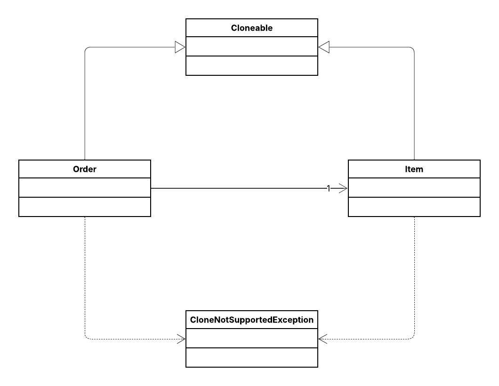

## 🛍️ Gerenciamento de Pedidos (Order)

Este projeto demonstra a aplicação do **Padrão de Projeto Prototype**.

O objetivo principal do padrão Prototype é **especificar os tipos de objetos a serem criados usando uma instância protótipo e criar novos objetos pela cópia desse protótipo**. No nosso cenário de **Gerenciamento de Pedidos**, ele resolve o problema de criar novos pedidos (`Order`) baseados em um modelo existente, sendo **essencial** garantir que o objeto composto (`Item`) também seja clonado, evitando que modificações no clone afetem o original (o conceito de **Cópia Profunda**).

---

## 📌 Diagrama de Classes

---
## 👩‍💻 Autora

Eduarda Araujo Carvalho

---

Tem mais alguma seção que você gostaria de adicionar a este README, como instruções de execução ou pré-requisitos?
